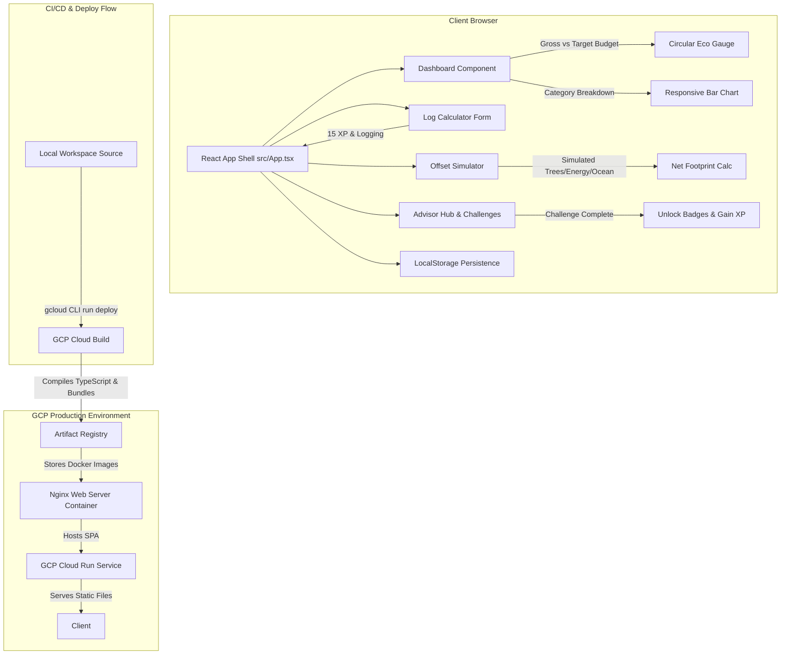
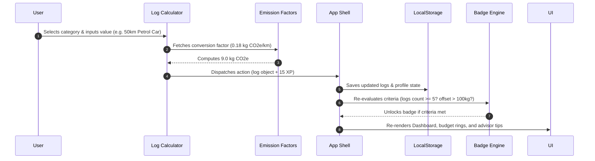
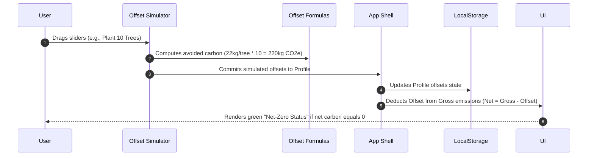

# 🌱 EcoStep Premium: Carbon Footprint Tracker & Insights

EcoStep Premium is an interactive, gamified single-page React web application designed to help individuals calculate, track, and offset their carbon footprint through simple actions and rules-based advisor audits.

🔗 **Production Deployment URL:** [https://ecostep-premium-955161174564.us-central1.run.app](https://ecostep-premium-955161174564.us-central1.run.app)

---

## 🏛️ Project Architecture Diagram

The application is structured as a component-driven client-side SPA persistence layer running inside a containerized Nginx web server, built in the cloud via GCP Cloud Build, and hosted serverless on GCP Cloud Run.



---

## 🔄 Core Workflows

### 1. Carbon Tracking & Gamification Flow

When a user logs a carbon footprint activity, emissions are computed using static coefficients, and XP status and badge criteria are dynamically updated.



### 2. Offsetting & Net-Zero Flow

Users can simulate offsetting projects (planting trees, investing in solar grids) to actively reduce their net emissions metrics.



---

## 🛠️ Technology Stack
*   **Framework**: React (Vite) with TypeScript.
*   **Styling**: Premium nature-themed custom CSS variables, glassmorphic card overlays, glowing indicator gauges, and transitions.
*   **Calculations**: Pre-configured global average coefficients for cars, public transit, flights, electricity grids, heating fuels, diets, and consumer shopping items.
*   **GCP Configurations**: Multi-stage `Dockerfile` and `nginx.conf` routing setups for URL fallbacks.

---

## 🚀 Local Setup & Run

1. **Clone the repository:**
   ```bash
   git clone https://github.com/sahil138-psk/ecostep-premium.git
   cd ecostep-premium
   ```

2. **Install dependencies:**
   ```bash
   npm install
   ```

3. **Start the local dev server:**
   ```bash
   npm run dev
   ```
   *Open [http://localhost:3000](http://localhost:3000) in your web browser.*

4. **Production Build compilation:**
   ```bash
   npm run build
   ```

---

## ☁️ Deploying to GCP Cloud Run
Refer to [gcp-deploy.md](gcp-deploy.md) for full commands. The simplest build-from-source command is:
```bash
gcloud run deploy ecostep-premium --source . --region us-central1 --allow-unauthenticated --port 8080 --project YOUR_PROJECT_ID
```
